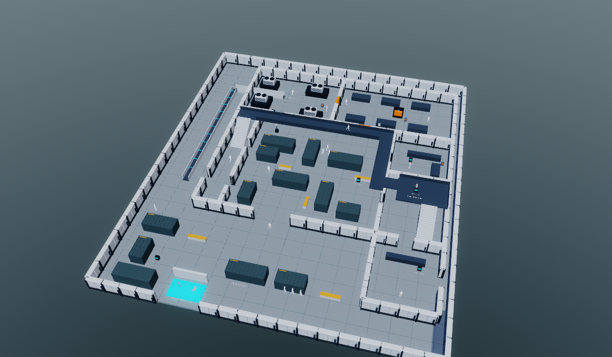
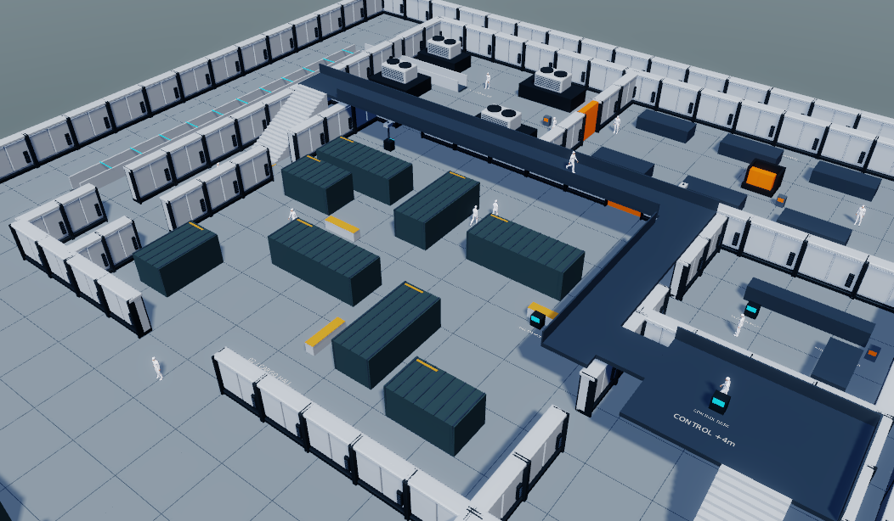

# CargoTerminal: CPU frustum culling, #2312

CPU culling включён штатно для недеформируемых mesh items и spatial batches.
Реальные mesh draws снизились на 26%, CPU-время рендера — на 11–14%.
Сравниваемые изображения и picking IDs совпадают побитно.

## Финальный A/B

Linux, NVIDIA GeForce RTX 5090, driver 595.84, Vulkan 1.3. Свежий процесс
SDK-редактора, offscreen window 1600×1000, editor viewport 1052×614.
CargoTerminal открыт из сохранённой сцены: все 177 cp_wall имеют batching;
генератор и сцена не изменялись этой работой. Play с editor pause, камеры
`tools/cargo_terminal/editor.py::camera(overview/hall)`. Между off/on состояние,
размеры и batching одинаковы. Захваты отключены, сборка и тесты завершены;
каждый результат — среднее последних 120 прогретых профилированных кадров.

| Ракурс | Culling | Mesh draws | CPU render, мс | CPU active frame, мс | GPU submissions, мс |
|---|---|---:|---:|---:|---:|
| overview | off | 2988 | 16.068 | 17.877 | 1.555 |
| overview | on | 2212 | 14.286 | 16.040 | 1.545 |
| hall | off | 2988 | 15.432 | 17.161 | 1.796 |
| hall | on | 2196 | 13.345 | 15.057 | 1.647 |

CPU render — scope `SceneManager Render`, active — CPU wall span кадра.
GPU — отдельные native timestamps, сумма GPU submissions, привязанных к кадру;
112 совпавших кадров, последние восемь исключены из-за асинхронной публикации.
GPU-замеры менялись между повторными сериями, поэтому устойчивый GPU-выигрыш
по этим коротким сериям не заявляется. CPU-выигрыш и draw reduction повторились.
Абсолютные времена относятся к этому headless сценарию.

`mesh_draws` из pass diagnostics равен числу `Encode mesh draw` во всех четырёх
замерах. В паузе постоянно рендерится editor target; game/FOV targets не нужно
считать постоянно выполняющимися проходами. Game-ресурсы проверены отдельно.
Максимум 118 секций ниже cap 256, подробные scopes не обрезаны.

В overview Color/Depth/Id сохраняют все 498 mesh items, включая 168 без
пригодных bounds; выигрыш идёт из shadow cascades (168/168/382 draws).
В hall Color/Depth/Id отсекают по 94 из 330 проверяемых items и отправляют
по 404 mesh draws; shadow cascades отправляют 185/303/496. Items без bounds
остаются для отрисовки.

## Проверка изображения и регрессии

Девять off/on сравнений дали **0 изменённых пикселей**:
editor Color, Depth, Id в overview и hall; game Color, Normal, ActorAttribute
при неизменной игровой камере (800×600). Для Depth сравнивался экспортированный
preview; точная depth-проверка теней дополнительно выполнена GPU smoke-тестом.
SHA-256 обоих PNG, счётчики и 480 покадровых метрик сохранены в
[JSON-отчёте](2026-10-07-cargo-frustum-culling.json).

Первый A/B выявил старую нестабильную сортировку равных shader/priority keys:
удаление невидимых items меняло порядок сохранившейся coplanar геометрии.
Добавлен последний ключ — исходный snapshot item index — в Color, Geometry,
DepthOnly, Shadow и ActorAttribute. После пересборки различия исчезли.
Регрессия IdPass проверяет двух coplanar survivors среди 38 offscreen мешей,
сохранение порядка и победителя picking.

Сохранены также [overview ID](cargo-frustum-culling-2026-10-07/overview-id.png)
и [hall ID](cargo-frustum-culling-2026-10-07/hall-id.png). Off/on PNG идентичны,
поэтому в репозитории хранится по одной копии.

## Воспроизведение

1. `task build -- --no-ccache`; запустить `sdk/bin/termin_editor` с проектом
   ChronoSquad и параметрами `--headless --offscreen-backend vulkan
   --offscreen-size 1600x1000 --frames 1000000`. Агентский MCP: port 0,
   уникальный session file в `/tmp`, вне пользовательского registry.
2. В MCP namespace вызвать `game_mode_controller.model.toggle_game_mode()`;
   после активации Play отдельным вызовом `model.toggle_pause()`.
3. Отменить захваты через `framegraph_debugger_native.cancel_request()` и
   `.disconnect()`. Загрузить `tools/cargo_culling_probe.py` через `exec-file`
   или `exec(open(...).read())`.
4. `prepare(globals(), 'overview', False)`, дождаться более 120 кадров;
   `sample(globals(), '/tmp/overview-off.json',
   native_library='/path/to/sdk/lib/libtermin_base.so')`. Повторить для True
   и для hall. `prepare` очищает history и diagnostics.
5. Отдельно захватить editor target (index 1) resources `color_tonemapped`,
   `depth`, `id` и game target (index 0) `ColorPass_3_output_res`,
   `NormalPass_15_output_res`, `ActorAttributePass_21_output_res`.
   Не использовать `inspect_framegraph`: ограничение #565 остаётся в силе.
   Перед новым timing снова отключить захваты и прогреть кадры.

## Сборка и тесты

Финальные `task build -- --no-ccache` и `task lint:python` успешны.
`task test -- --no-ccache`: **268/268 CTest passed**, включая bounds/cache,
frustum/stereo, batch transform/mesh rebuild, independent views/picking,
coplanar order и Vulkan ShadowPass pixel/depth regression с caster за основной
камерой, движением камеры и 2/4 каскадами. Другой shadow-тест проверяет также
3 каскада и сохранение fitting при toggle.

Общий `task test` завершился с ошибкой: единственный failing Python reference
test `test_native_textured_pixal3d_geometry_reference` отвергает generated
TANGENT в vertex 0 внешнего `character_full_1536.glb`; в его suite 163 passed,
1 failed. Остальные suites, SDK import graph и lint прошли. Дефект записан в
**#2885**, GLB parser не изменялся в #2312; полного зелёного task test нет.
Ранний запуск `task test -- --python --no-ccache` воспроизвёл тот же отказ.

Логи и полные исходные captures/profiles: `/tmp/termin-2312-cargo`,
`/tmp/termin-2312-final-build.log`, `/tmp/termin-2312-final-test.log`.
На старте видны ошибки legacy TransparentShader, UI presentation metrics и
разовый RingUBO overflow; повторных bounds/frustum ошибок не найдено.
Связанные Bloom #2683 и shutdown #1370 в этот scope не включены.
Собственный изолированный редактор закрыт штатно (exit 0); пользовательский
редактор не перезапускался.

Контракт реализации: [frustum-culling.md](../../engine/termin-render/docs/frustum-culling.md).
