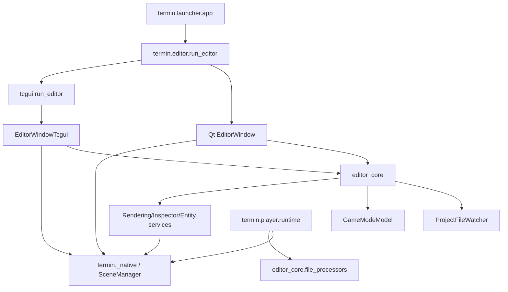
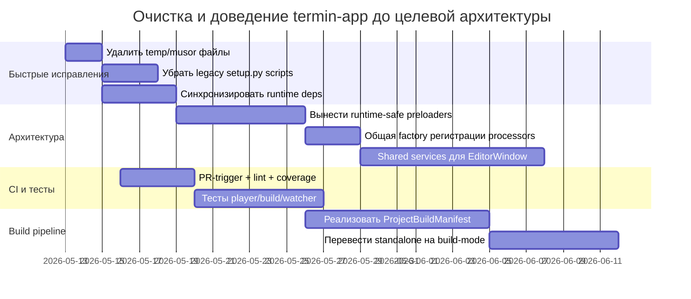

# Аудит репозитория mirmik/termin с фокусом на termin-app

Репозиторий — это крупный монорепозиторий движка и сопутствующих пакетов, в котором `termin-app` выступает как верхнеуровневый Python/C++ слой: редактор, лаунчер, player, ассетная загрузка, часть UI, standalone-сборка и glue-код между остальными `termin-*` модулями. По факту это не «одно приложение», а интеграционный узел всей экосистемы. fileciteturn66file0 fileciteturn60file0 fileciteturn61file0

Главный вывод: архитектура `termin-app` уже движется в правильную сторону — выделен `editor_core/`, задокументирован MVC-рефакторинг, введён tcgui-фронтенд, оформлен план build-manifest для player. Но миграция завершена только частично: в дереве одновременно живут Qt- и tcgui-реализации, player по-прежнему импортирует editor-side file processors, упаковка завязана на legacy `setup.py` и ручное копирование артефактов, а два больших `EditorWindow` продолжают держать слишком много ответственности. Это создаёт tight coupling, дублирование, высокий риск регрессий и плохую воспроизводимость сборок. fileciteturn27file0 fileciteturn28file0 fileciteturn29file0 fileciteturn63file0 fileciteturn75file0 fileciteturn55file0 fileciteturn56file0

Самые приоритетные проблемы для cleanup:
1. **Развязать runtime и editor**: вынести preloaders/asset scanning из `termin.editor_core.file_processors` в runtime-safe пакет, чтобы player перестал зависеть от editor-кода. fileciteturn26file0 fileciteturn75file0  
2. **Схлопнуть дублирование Qt/tcgui orchestration**: общие сценарии attach/detach/render/game-mode/file-processor registration надо вынести из `editor_window.py` и `editor_tcgui/editor_window.py` в shared services/model layer. fileciteturn27file0 fileciteturn55file0 fileciteturn56file0  
3. **Привести packaging в порядок**: убрать legacy `setup.py install`, перестать бандлить «что найдено в site-packages», синхронизировать `install_requires` и `requirements.txt`, сделать сборку воспроизводимой. fileciteturn30file0 fileciteturn59file0 fileciteturn60file0 fileciteturn64file0 fileciteturn65file0  
4. **Очистить дерево от мусора и accidental commits**: временный `.claude`-файл, пустой README, дубль audit-файла с опечаткой, закомментированный отладочный код. fileciteturn52file0 fileciteturn31file0 fileciteturn53file0 fileciteturn54file0 fileciteturn57file0

## Обзор проекта

По исследованным файлам репозиторий устроен как набор связанных пакетов и библиотек: `termin-base`, `termin-mesh`, `termin-graphics`, `termin-modules`, `termin-scene`, `termin-render`, `termin-display`, `termin-gui`, `termin-nodegraph`, `termin-engine`, `termin-components/*`, `termin-app`, `tcplot` и другие. Установка Python-пакетов идёт в топологическом порядке через общий `install-pip-packages.sh`, а `termin-app` указан ближе к концу списка как владелец корневого namespace `termin`. Это подтверждает, что репозиторий — именно monorepo с thin Python packages поверх общего SDK и C++-ядра. fileciteturn66file0

### Языки, фреймворки и платформы

В `termin-app` сочетаются:
- **Python** для UI, orchestration, asset loading, launcher/player, tests;
- **C++20/C** для native libraries и embedded executables;
- **Qt/PyQt6** и **tcgui** как два параллельных UI-стека;
- **SDL2**, **OpenGL** и tgfx2/BackendWindow-подсистема для рендеринга и ввода;
- asset/data-файлы `.ui`, `.uiscript`, `.glsl`, `.shader`, `.material`, `.meta`, `.png`, `.txt`. fileciteturn30file0 fileciteturn49file0 fileciteturn50file0 fileciteturn60file0 fileciteturn61file0

Судя по CMake и коду, официальный automation-path покрывает **Linux**; при этом в коде есть явные ветки для **Windows** и частично для macOS-окружения настроек. tcgui-редактор и player выбирают графический backend через `TERMIN_BACKEND` (`opengl`/`vulkan`), а standalone player по умолчанию сам выставляет `opengl`. fileciteturn60file0 fileciteturn50file0 fileciteturn51file0 fileciteturn75file0

### Build/test tooling, CI и package managers

Инструментарий сборки у проекта многослойный:
- **CMake** для native-части и standalone install tree;
- **setuptools/setup.py** для wheel/sdist и thin Python packages;
- **shell scripts** (`build.sh`, `install-pip-packages.sh`, `run-tests-python.sh`, `run-tests-cpp.sh`);
- **GitHub Actions** как CI;
- **pip editable installs** и ручное копирование в SDK/install. fileciteturn63file0 fileciteturn64file0 fileciteturn65file0 fileciteturn66file0 fileciteturn34file0 fileciteturn62file0

CI-файл показывает важное ограничение: workflow запускается только на `push` в `master`, а не на pull requests; матрицы платформ нет; нет lint/typecheck/coverage jobs; для `termin-app` в CI гоняется только `pytest termin-app/tests/ -v` в headless Qt-режиме. Это уменьшает шанс поймать регрессии до merge и сужает покрытие реальных сценариев сборки/запуска. fileciteturn62file0

### Build artifacts

`termin-app` производит два разных класса артефактов:
- **standalone install tree**: `install/bin/termin_editor`, `install/bin/termin_launcher`, bundled Python runtime и `install/lib/python/termin`;
- **Python distributions**: wheel и sdist через `tools/build_dists.sh`.  
При этом `build.sh` дополнительно копирует `.so` и Python-пакеты из SDK и из соседних subprojects вручную, что делает цепочку сборки очень хрупкой. fileciteturn60file0 fileciteturn61file0 fileciteturn63file0 fileciteturn64file0

## Детальная анатомия termin-app

### Сокращённое дерево модуля

Ниже — **сокращённое рабочее дерево**, отражающее ключевые каталоги и точки входа, а не полный листинг:

```text
termin-app/
  CMakeLists.txt
  setup.py
  requirements.txt
  build.sh
  README.md
  docs/
    editor-architecture.md
    project-build-manifest.md
  cpp/
    CMakeLists.txt
    app/
    termin/
      bindings/
      editor/
      render/
  termin/
    editor/
      __main__.py
      run_editor.py
      editor_window.py
    editor_tcgui/
      run_editor.py
      editor_window.py
    editor_core/
      __init__.py
      game_mode_model.py
      project_file_watcher.py
      settings.py
    launcher/
      app.py
    player/
      __init__.py
      __main__.py
      runtime.py
    assets/
    loaders/
    visualization/
  tests/
    test_game_mode_model.py
    test_scene_file_model.py
    test_scene_manager_viewer.py
  tools/
    build_dists.sh
    reinstall_local.sh
```

Эта структура подтверждается исследованными `fetch_file` по CMake/setup/build/test/entrypoint-файлам и тестам. fileciteturn60file0 fileciteturn30file0 fileciteturn59file0 fileciteturn63file0 fileciteturn49file0 fileciteturn50file0 fileciteturn45file0 fileciteturn71file0 fileciteturn69file0 fileciteturn75file0 fileciteturn35file0 fileciteturn44file0 fileciteturn36file0

### Точки входа и «маршрутизация»

У `termin-app` нет отдельного routing-framework; вместо этого маршрутизация императивная и происходит через CLI flags и callback-based orchestration:

- `termin.editor.__main__` → `run_editor()`;  
- `termin.editor.run_editor` парсит `--ui=qt|tcgui` и делегирует в `termin.editor_tcgui.run_editor.init_editor_tcgui()` при tcgui;  
- `termin.player.__main__` разводит project-mode и build-mode через `project` versus `--build`;  
- `termin.player.__init__` делает публичными `PlayerRuntime`, `run_project`, `run_build`;  
- `launcher/app.py` поднимает backend window и запускает `termin_editor` через subprocess. fileciteturn49file0 fileciteturn50file0 fileciteturn69file0 fileciteturn70file0 fileciteturn71file0

Это удобно для быстрого развития, но плохо масштабируется: CLI parsing, UI backend selection, editor bootstrapping и subprocess launching разложены по разным файлам без общего application service layer. В результате поведение легко расходится между Qt/tcgui/launcher/player. fileciteturn49file0 fileciteturn50file0 fileciteturn71file0

### Публичный API

Явно оформленный API у `termin-app` узкий и неравномерный:
- `termin.editor_core.__all__` экспортирует только `MenuItemSpec`, `MenuSpec`, `build_editor_menu_spec`, `scene_name_from_file_path`;
- `termin.player.__all__` экспортирует `PlayerRuntime`, `run_build`, `run_project`.  
Всё остальное в основном потребляется как внутренние модули по прямым импортам. Это говорит о том, что пакет больше внутренний интеграционный слой, чем стабильный consumer-facing API. fileciteturn45file0 fileciteturn70file0

### Компоненты, сервисы и модели данных

Из документов и кода хорошо видны основные building blocks:
- **editor_core** — UI-agnostic слой (`Signal`, `DialogService`, `EntityOperations`, `InspectorModel`, `RenderingModel`, `GameModeModel`, `ProjectFileWatcher`, `EditorSettings`);
- **editor/** — Qt-view и orchestration;
- **editor_tcgui/** — tcgui-view и её orchestration;
- **player/** — standalone runtime;
- **launcher/** — project selection UI;
- **CPP native layer** — `entity_lib`, `render_lib`, optional `navmesh_lib`, executables. fileciteturn27file0 fileciteturn28file0 fileciteturn38file0 fileciteturn72file0 fileciteturn51file0 fileciteturn61file0

Как модели данных особенно важны:
- `PreLoadResult` для ассетов и preload pipeline;
- `EditorSettings` как JSON-backed config wrapper;
- `GameModeModel` как Play/Stop/Pause orchestration;
- `ProjectBuildManifest` как **запланированная**, но ещё не доведённая до конца модель продуктовой сборки. fileciteturn72file0 fileciteturn51file0 fileciteturn38file0 fileciteturn26file0

### Конфигурация

Конфигурация разбросана по нескольким уровням:
- env vars: `TERMIN_BACKEND`, `TERMIN_SDK`, `LD_LIBRARY_PATH`;
- CMake options: `BUILD_EDITOR_MINIMAL`, `BUILD_EDITOR_EXE`, `BUILD_TESTS`, `BUNDLE_PYTHON`, `USE_SYSTEM_SDL2`, `TERMIN_BUILD_PYTHON`;
- runtime settings: `EditorSettings` через `tcbase.Settings`;
- CLI flags: `--ui`, `--debug-resource`, `--build`, `--scene`, `--width`, `--height`, `--title`. fileciteturn49file0 fileciteturn50file0 fileciteturn51file0 fileciteturn60file0 fileciteturn61file0 fileciteturn69file0

Нормально для engine/tooling stack, но сейчас это плохо централизовано: config ownership размазан между shell scripts, CMake, Python entrypoints и настройками редактора.

### Связи модулей



Схема отражает ключевую проблему: `player` всё ещё тянет editor-side preloaders, а оба frontend-окна имеют собственный orchestration слой поверх shared `editor_core`. fileciteturn49file0 fileciteturn50file0 fileciteturn75file0 fileciteturn27file0

## Ключевые проблемы и запахи кода

### Самые серьёзные архитектурные дефекты

**Главный layering violation**: `termin.player.runtime` импортирует `termin.editor_core.file_processors` и сам собирает список preloaders. Это прямо противоречит документу `project-build-manifest.md`, где зафиксировано, что build step должен быть отдельным, player должен грузить build manifest, а shared preloaders нужно вынести в runtime-safe пакет. Сейчас runtime всё ещё зависит от editor-side кода. fileciteturn75file0 fileciteturn26file0

**God object / misplaced responsibility**: оба `editor_window.py` делают слишком много сразу — undo stack, scene lifecycle, resource loader, file watcher, dialogs, menu wiring, viewport/rendering, project browser, input router, game mode, profiler/modules panels, load/save scene state. Даже после `editor_core`-рефакторинга orchestration layer остаётся чрезмерно толстым. fileciteturn55file0 fileciteturn56file0 fileciteturn28file0

**Незавершённая миграция Qt → tcgui**: документы честно фиксируют, что tcgui активен, Qt пока остаётся «золотым стандартом», а часть диалогов всё ещё view-specific и переводится opportunistic. При этом `run_editor.py` уже default-ит `tcgui`, а `setup.py` всё ещё требует `PyQt6>=6.4`. Это нормальная стадия миграции, но технически означает двойную стоимость поддержки. fileciteturn29file0 fileciteturn27file0 fileciteturn49file0 fileciteturn30file0

### Конкретные файлы, требующие cleanup

| Файл / компонент | Проблема | Приоритет | Оценка | Основание |
|---|---|---:|---:|---|
| `termin-app/termin/player/runtime.py` | runtime зависит от `editor_core.file_processors`; сканирует проект вручную | P0 | M | fileciteturn75file0 fileciteturn26file0 |
| `termin-app/termin/editor/editor_window.py` | Qt god object, много responsibilities | P0 | L | fileciteturn55file0 |
| `termin-app/termin/editor_tcgui/editor_window.py` | tcgui god object, дублирует orchestration Qt-версии | P0 | L | fileciteturn56file0 |
| `termin-app/setup.py` | stale metadata, legacy packaging, install_requires расходится с реальным runtime | P0 | M | fileciteturn30file0 |
| `termin-app/CMakeLists.txt` | bundling host `site-packages`, нерепродуцируемая поставка | P0 | M | fileciteturn60file0 |
| `termin-app/build.sh` | ручное копирование `.so` и Python-пакетов, tight coupling к дереву repo | P1 | M | fileciteturn63file0 |
| `termin-app/termin/launcher/app.py` | tcgui launcher использует `tkinter` dialogs и subprocess-bootstrapping | P1 | S | fileciteturn71file0 |
| `termin-app/termin/editor_core/project_file_watcher.py` | full rescans, os.walk+sort, debounce complexity, filesystem hot path | P1 | M | fileciteturn72file0 |
| `termin-app/.claude/settings.local.json.tmp...` | accidental temp file, утечка локальных permissions/paths | P1 | S | fileciteturn52file0 |
| `termin-app/tools/reinstall_local.sh` | obsolete `setup.py install --user` | P1 | S | fileciteturn65file0 |
| `termin-app/tools/build_dists.sh` | obsolete `setup.py bdist_wheel/sdist` | P1 | S | fileciteturn64file0 |
| `termin-app/README.md` | пустой файл, документационный dead file | P2 | S | fileciteturn31file0 |
| `error-handding-audit-files.txt` / `error-handling-audit-files.txt` | дублирующиеся audit artifacts, один с typo | P2 | S | fileciteturn53file0 fileciteturn54file0 |
| `termin-app/termin/editor/__main__.py` | закомментированный GC debug code, лишний `gc` import | P2 | S | fileciteturn57file0 |

### Примеры проблемных мест

**Layering violation в player:**

```python
# termin-app/termin/player/runtime.py
from termin.editor_core.file_processors import (
    MaterialPreLoader,
    ShaderPreLoader,
    ...
    UIPreLoader,
)
```

Это делает player зависимым от editor-side сущностей и затрудняет отделение runtime от tooling. fileciteturn75file0

**Accidental temp/config commit:**

```json
// termin-app/.claude/settings.local.json.tmp.127268.1767261910893
{
  "permissions": {
    "allow": [
      "Bash(pip install:*)",
      "Bash(gdb:*)",
      ...
    ]
  }
}
```

Такой файл не должен жить в production-репозитории: он раскрывает локальные рабочие паттерны, абсолютные пути и tool-permission policy конкретной машины/сессии. fileciteturn52file0

**Obsolete packaging script:**

```bash
# termin-app/tools/reinstall_local.sh
./setup.py install --user
```

Это legacy-путь установки, который лучше заменить на `pip install .` или editable/PEP 517 flow. fileciteturn65file0

**Закомментированная отладка в entrypoint:**

```python
# termin-app/termin/editor/__main__.py
# def gc_callback(phase, info):
#     ...
# gc.callbacks.append(gc_callback)
```

Такой код сигнализирует о незавершённой ручной диагностике и засоряет entrypoint-файл. fileciteturn57file0

### Дублирование и неясные границы модулей

Документы по MVC-рефакторингу показывают, что `editor_core` уже выделен как UI-agnostic слой, но фактический код всё ещё дублирует большой orchestration between Qt and tcgui. Одинаковые или почти одинаковые обязанности видны как минимум в attach/detach scene, rendering attachment, undo/redo, menu wiring, project loading, viewport setup, interaction selection. Это не просто эстетический дефект: любая новая feature должна внедряться минимум в двух толстых фронтенд-окнах. fileciteturn27file0 fileciteturn28file0 fileciteturn55file0 fileciteturn56file0

Отдельно видно смешение UI-стеков: `launcher/app.py` строит интерфейс на tcgui, но для выбора директорий и проекта использует `tkinter.filedialog`. Это рабочий pragmatic workaround, но как архитектурное решение ломает слой абстракции UI и усложняет platform consistency. fileciteturn71file0

## Зависимости, тесты и CI

### Зависимости и packaging risks

Самая важная проблема здесь не в том, что «какая-то библиотека устарела», а в том, что поставка **нерепродуцируема**. `termin-app/CMakeLists.txt` при `BUNDLE_PYTHON=ON` буквально копирует набор внешних пакетов (`numpy`, `PyQt6`, `Pillow`, `scipy`, `glfw`, `OpenGL`, `pyassimp`, `yaml`, `watchdog` и др.) из текущего host `site-packages` в install tree. Это означает:
- нет lockfile/SBOM на bundled runtime;
- транзитивные уязвимости зависят от машины, где делали bundle;
- diff между сборками трудно объяснить;
- security/release audit становится неточным. fileciteturn60file0

Кроме того, `setup.py` и `requirements.txt` расходятся. В `requirements.txt` есть `PyYAML`, `pysdl2`, `pysdl2-dll`, `watchdog`, а в `install_requires` файла `setup.py` их нет; при этом в коде `project_file_watcher.py` действительно используется watchdog, а tcgui/launcher активно импортируют `sdl2`. Это уже не «возможное», а фактическое несовпадение runtime-деклараций и реального кода. fileciteturn59file0 fileciteturn30file0 fileciteturn72file0 fileciteturn50file0 fileciteturn71file0

Отдельно бросается в глаза stale package metadata: `setup.py` описывает `termin-app` как **“Projective geometry library”** с ключами `testing` и `cad`, а опубликованный пакет `termin` на PyPI по состоянию на май 2026 сохраняет версию `0.0.0` и пустое описание. Это не bug runtime, но сильный сигнал запущенности release hygiene. fileciteturn30file0 citeturn5search0

### Тесты

`termin-app` содержит по меньшей мере три явно найденных тестовых файла:
- `test_game_mode_model.py` — хорошие unit-ish тесты на `GameModeModel` и attachment paths через monkeypatch/stubs;
- `test_scene_file_model.py` — очень узкий smoke test на `scene_name_from_file_path`;
- `test_scene_manager_viewer.py` — environment-sensitive тест, создающий `QApplication` и проверяющий viewer formatting. fileciteturn35file0 fileciteturn44file0 fileciteturn36file0

Покрытие явно неполное. Почти наверняка **не покрыты**:
- `build.sh` и standalone bundle path;
- `launcher/app.py`;
- `player/runtime.py` в build-mode и project-mode;
- `project_file_watcher.py` с реальными filesystem events;
- parity между `editor/` и `editor_tcgui/`;
- packaging/install flows.  
Даже `test_scene_manager_viewer.py` зависит от headless Qt (`QT_QPA_PLATFORM=offscreen`), что делает его чувствительным к CI-окружению. fileciteturn36file0 fileciteturn62file0

### CI

CI конфиг полезен, но явно недостаточен для такого монорепо:
- нет запуска на PR;
- нет platform matrix;
- нет линтеров, static typing, coverage upload;
- `termin-app` тестируется только `pytest termin-app/tests/ -v`;
- сборка/упаковка проверяются shell-script-путями, но без отчётности coverage/junit. fileciteturn62file0

Актуальные красные/зелёные статусы workflow-run’ов я в этом отчёте **не верифицировал отдельно**; выводы по CI основаны на самом YAML workflow, а не на свежих run logs.

## Приоритетный план очистки

### Рекомендуемый порядок PR-ов

| PR scope | Что менять | Effort | Risk | Почему это первым |
|---|---|---:|---:|---|
| Runtime/editor decoupling | Вынести preloaders в `termin.runtime_assets` или `termin.assets.preloaders`, перевести `player/runtime.py` на новый пакет | M | M | Убирает самый грубый layering violation |
| Shared editor orchestration | Вынести attach/detach/render/game-mode/file-processor setup из обоих `EditorWindow` в shared services | L | H | Схлопывает дублирование и уменьшает стоимость миграции |
| Packaging hygiene | Синхронизировать `setup.py` и `requirements.txt`, удалить obsolete scripts, перейти на современный build flow | M | M | Убирает install/release ломкость |
| Source tree cleanup | Удалить temp/audit мусор, закомментированную отладку, пустые/ложные docs | S | L | Дешёвый быстрый выигрыш |
| CI hardening | PR trigger, линтеры, coverage, Linux matrix хотя бы для Qt/tcgui/player | M | L | Сразу снижает риск новых регрессий |
| File watcher hardening | Тесты watcher’а, нагрузочный smoke, инкрементальная оптимизация rescans | M | M | Снимает runtime/perf risk на больших проектах |
| Build manifest completion | Реально реализовать `ProjectBuildManifest` и перевести player на build-only для distribution | L | H | Завершает заявленную архитектуру |

### Конкретные изменения

#### PR: развязать player и editor

Минимальный рефакторинг:

```diff
- from termin.editor_core.file_processors import (
+ from termin.assets.preloaders import (
    MaterialPreLoader,
    ShaderPreLoader,
    TexturePreLoader,
    ...
 )
```

Идея не просто в переносе import path. Нужно создать слой, который:
- не импортирует UI;
- не знает про watcher/editor callbacks;
- пригоден и для build-step, и для player, и для editor.  
Именно это уже зафиксировано как целевое состояние в `project-build-manifest.md`. fileciteturn75file0 fileciteturn26file0

#### PR: убрать дублирование регистрации file processors

Сейчас оба окна создают watcher/resource loader и вручную регистрируют почти одинаковый список preloaders. Это стоит заменить на shared factory:

```diff
+ # termin/editor_core/default_preloaders.py
+ def create_default_preloaders(resource_manager, on_resource_reloaded=None):
+     return [
+         GlslPreLoader(resource_manager, on_resource_reloaded=on_resource_reloaded),
+         ShaderPreLoader(resource_manager, on_resource_reloaded=on_resource_reloaded),
+         TexturePreLoader(resource_manager, on_resource_reloaded=on_resource_reloaded),
+         ...
+     ]
```

```diff
- self._project_file_watcher.register_processor(MaterialPreLoader(...))
- self._project_file_watcher.register_processor(GlslPreLoader(...))
- ...
+ for processor in create_default_preloaders(self.resource_manager, self._on_resource_reloaded):
+     self._project_file_watcher.register_processor(processor)
```

Это маленький PR, но он сразу уменьшает drift между Qt и tcgui. fileciteturn55file0 fileciteturn56file0

#### PR: packaging modernisation

С практической точки зрения я бы сделал это в два подэтапа.

Сначала безопасный короткий шаг:
- удалить `tools/reinstall_local.sh`;
- заменить `tools/build_dists.sh` на `python -m build`;
- синхронизировать `install_requires` с реальными runtime imports;
- запретить бандлинг host `site-packages` без явного manifest/lock. fileciteturn64file0 fileciteturn65file0 fileciteturn30file0 fileciteturn60file0

Потом второй шаг:
- внедрить reproducible dependency manifest для bundled runtime;
- формировать SBOM/manifest сборки;
- прекратить ручное копирование по именам директорий из текущего Python окружения. fileciteturn60file0

### Предлагаемая дорожная карта



## Выводы и ограничения

По качеству архитектурного направления репозиторий производит хорошее впечатление: автор уже сделал самую сложную интеллектуальную часть — **понял правильное target state** и зафиксировал его документами (`editor_core`, MVC, build manifest, tcgui migration). Проблема не в отсутствии замысла, а в том, что `termin-app` пока остаётся точкой компромисса между старой и новой архитектурой. Поэтому накапливаются дубликаты, legacy-маршруты и ручные build/install костыли. fileciteturn27file0 fileciteturn28file0 fileciteturn29file0 fileciteturn26file0

Самый правильный cleanup здесь — **не «косметический»**, а **границ-модулей и ownership**:
- player не должен знать об editor-side file processors;
- frontend-окна не должны сами быть центром всей бизнес-логики;
- bundled runtime не должен строиться копированием случайного состояния host environment;
- CI должен проверять изменения до попадания в `master`. fileciteturn75file0 fileciteturn55file0 fileciteturn56file0 fileciteturn60file0 fileciteturn62file0

### Открытые вопросы и ограничения

Я сознательно не делаю жёстких заявлений по следующим пунктам:
- **точные текущие upstream-версии** зависимостей и их свежесть относительно PyPI/официальных релизов;
- **конкретные CVE/OSV** для транзитивных зависимостей;
- **актуальные падающие GitHub Actions runs** на момент написания;
- **полный, исчерпывающий file tree** всего `termin-app`, а не рабочего сокращённого дерева.  

Эти пункты требуют отдельного dependency scan / свежей проверки workflow runs / полного tree export.

## Источники

### Основной репозиторий

- urlmirmik/termin на GitHubhttps://github.com/mirmik/termin

### Ключевые GitHub-файлы, использованные в анализе

- `install-pip-packages.sh` — монорепо, порядок пакетов, thin-package модель. fileciteturn66file0
- `termin-app/CMakeLists.txt` — standalone build, bundled Python, host-site-packages copy. fileciteturn60file0
- `termin-app/cpp/CMakeLists.txt` — native libs, optional executables, tests, SDL/OpenGL, install/export. fileciteturn61file0
- `termin-app/setup.py` — packaging, metadata, install_requires. fileciteturn30file0
- `termin-app/requirements.txt` — declared dev/runtime requirements. fileciteturn59file0
- `termin-app/build.sh` — standalone build pipeline и ручное копирование артефактов. fileciteturn63file0
- `termin-app/tools/build_dists.sh` — legacy wheel/sdist path. fileciteturn64file0
- `termin-app/tools/reinstall_local.sh` — legacy install path. fileciteturn65file0
- `termin-app/docs/editor-architecture.md` — целевая editor architecture. fileciteturn27file0
- `docs/plans/2026-04-21-termin-app-editor-mvc-refactor.md` — статус MVC-рефакторинга. fileciteturn28file0
- `docs/plans/2026-03-09-termin-app-tcgui-migration.md` — план миграции Qt → tcgui. fileciteturn29file0
- `termin-app/docs/project-build-manifest.md` — целевая build/publish архитектура. fileciteturn26file0
- `termin-app/termin/editor/run_editor.py` — editor entrypoint и `--ui` routing. fileciteturn49file0
- `termin-app/termin/editor_tcgui/run_editor.py` — tcgui bootstrap и SDL event dispatch. fileciteturn50file0
- `termin-app/termin/editor/editor_window.py` — Qt orchestration. fileciteturn55file0
- `termin-app/termin/editor_tcgui/editor_window.py` — tcgui orchestration. fileciteturn56file0
- `termin-app/termin/editor_core/__init__.py` — публичный API editor_core. fileciteturn45file0
- `termin-app/termin/editor_core/game_mode_model.py` — game mode model. fileciteturn38file0
- `termin-app/termin/editor_core/project_file_watcher.py` — filesystem watcher и preload pipeline. fileciteturn72file0
- `termin-app/termin/editor_core/settings.py` — JSON-backed editor settings. fileciteturn51file0
- `termin-app/termin/player/__init__.py`, `__main__.py`, `runtime.py` — public API и runtime player. fileciteturn70file0 fileciteturn69file0 fileciteturn75file0
- `termin-app/termin/launcher/app.py` — launcher UI и subprocess bootstrapping. fileciteturn71file0
- `termin-app/tests/test_game_mode_model.py`, `test_scene_file_model.py`, `test_scene_manager_viewer.py` — текущее тестовое покрытие. fileciteturn35file0 fileciteturn44file0 fileciteturn36file0
- `.github/workflows/ci.yml` — CI scope и ограничения. fileciteturn62file0
- `.claude/settings.local.json.tmp.127268.1767261910893` — accidental temp/config commit. fileciteturn52file0
- `error-handding-audit-files.txt`, `error-handling-audit-files.txt` — audit artifacts / tree noise. fileciteturn53file0 fileciteturn54file0
- `termin-app/README.md` — пустой README. fileciteturn31file0
- `termin-app/termin/editor/__main__.py` — закомментированная GC debug-логика. fileciteturn57file0

### Внешние источники

- urlпакет termin на PyPIhttps://pypi.org/project/termin/ — для проверки опубликованных metadata пакета. citeturn5search0