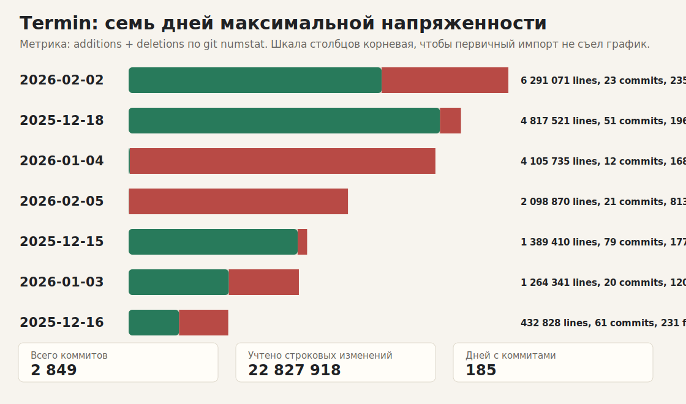
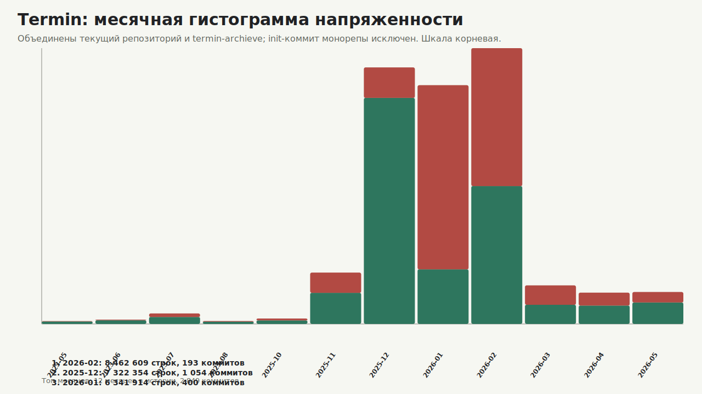

# Отчет по напряженности разработки

Сгенерировано из локальной git-истории 2026-05-21.

Полная дневная выгрузка: [`development-tension-daily.csv`](./development-tension-daily.csv).

## Сводка

- Окно истории: 2023-05-27 .. 2026-05-21
- Источников истории: archive (1985), monorepo (864)
- Коммитов: 2 849
- Дней с коммитами: 185
- Месяцев с коммитами: 12
- Добавлено строк: 12 546 907
- Удалено строк: 10 281 011
- Суммарный churn строк: 22 827 918
- Файловых записей в numstat: 27 618
- Бинарных файловых записей: 370
- Авторы по числу коммитов: netricks (986), koven (846), kuro (587)
- Исключены коммиты: 66e14f13cd

## Главный вывод

Самый напряженный сезон по строковому churn - **2026 Q1**: 14 970 044 строковых изменений. Если смотреть календарными месяцами, основной вал пришелся на 2026-02, 2025-12, 2026-01: 22 126 877 строковых изменений суммарно.

## Семь самых горячих дней

| Место | Дата | Churn | Добавлено | Удалено | Коммиты | Файлы | Бинарные | Авторы |
| ---: | --- | ---: | ---: | ---: | ---: | ---: | ---: | --- |
| 1 | 2026-02-02 | 6 291 071 | 4 193 632 | 2 097 439 | 23 | 2 358 | 108 | kuro (16), mirmik (4), netricks (3) |
| 2 | 2025-12-18 | 4 817 521 | 4 514 471 | 303 050 | 51 | 196 | 5 | koven (48), kuro (3) |
| 3 | 2026-01-04 | 4 105 735 | 16 014 | 4 089 721 | 12 | 168 | 13 | kuro (12) |
| 4 | 2026-02-05 | 2 098 870 | 3 625 | 2 095 245 | 21 | 813 | 36 | mirmik (8), netricks (7), kuro (6) |
| 5 | 2025-12-15 | 1 389 410 | 1 316 064 | 73 346 | 79 | 177 | 11 | koven (78), kuro (1) |
| 6 | 2026-01-03 | 1 264 341 | 744 544 | 519 797 | 20 | 120 | 6 | kuro (20) |
| 7 | 2025-12-16 | 432 828 | 219 381 | 213 447 | 61 | 231 | 4 | koven (58), kuro (3) |

## Дни с максимумом коммитов

| Место | Дата | Коммиты | Churn | Добавлено | Удалено | Файлы | Авторы |
| ---: | --- | ---: | ---: | ---: | ---: | ---: | --- |
| 1 | 2025-12-14 | 122 | 166 948 | 144 704 | 22 244 | 232 | koven (116), kuro (6) |
| 2 | 2025-12-13 | 115 | 15 125 | 13 100 | 2 025 | 267 | koven (106), kuro (9) |
| 3 | 2025-12-12 | 93 | 8 704 | 6 476 | 2 228 | 187 | koven (92), kuro (1) |
| 4 | 2025-12-17 | 83 | 11 087 | 6 780 | 4 307 | 245 | koven (83) |
| 5 | 2025-12-15 | 79 | 1 389 410 | 1 316 064 | 73 346 | 177 | koven (78), kuro (1) |
| 6 | 2025-12-09 | 62 | 10 347 | 7 137 | 3 210 | 180 | koven (62) |
| 7 | 2025-12-16 | 61 | 432 828 | 219 381 | 213 447 | 231 | koven (58), kuro (3) |

## Самые напряженные месяцы

| Место | Месяц | Churn | Добавлено | Удалено | Коммиты | Файлы | Источники |
| ---: | --- | ---: | ---: | ---: | ---: | ---: | --- |
| 1 | 2026-02 | 8 462 609 | 4 230 496 | 4 232 113 | 193 | 4 772 | archive (193) |
| 2 | 2025-12 | 7 322 354 | 6 452 069 | 870 285 | 1 054 | 5 215 | archive (1054) |
| 3 | 2026-01 | 6 341 914 | 1 450 164 | 4 891 750 | 400 | 6 541 | archive (400) |
| 4 | 2025-11 | 293 365 | 177 873 | 115 492 | 160 | 1 988 | archive (160) |
| 5 | 2026-03 | 165 521 | 82 255 | 83 266 | 269 | 2 543 | monorepo (189), archive (80) |
| 6 | 2026-05 | 113 551 | 76 346 | 37 205 | 335 | 2 965 | monorepo (335) |
| 7 | 2026-04 | 109 076 | 64 103 | 44 973 | 340 | 3 148 | monorepo (340) |
| 8 | 2023-07 | 12 308 | 8 157 | 4 151 | 56 | 229 | archive (56) |
| 9 | 2025-10 | 3 294 | 2 162 | 1 132 | 13 | 126 | archive (13) |
| 10 | 2023-06 | 2 054 | 1 756 | 298 | 15 | 38 | archive (15) |

## Самые напряженные кварталы

| Место | Квартал | Churn | Добавлено | Удалено | Коммиты | Файлы | Источники |
| ---: | --- | ---: | ---: | ---: | ---: | ---: | --- |
| 1 | 2026 Q1 | 14 970 044 | 5 762 915 | 9 207 129 | 862 | 13 856 | archive (673), monorepo (189) |
| 2 | 2025 Q4 | 7 619 013 | 6 632 104 | 986 909 | 1 227 | 7 329 | archive (1227) |
| 3 | 2026 Q2 | 222 627 | 140 449 | 82 178 | 675 | 6 113 | monorepo (675) |
| 4 | 2023 Q3 | 13 253 | 8 884 | 4 369 | 60 | 242 | archive (60) |
| 5 | 2023 Q2 | 2 981 | 2 555 | 426 | 25 | 78 | archive (25) |

## Крупнейшие коммиты

| Место | Дата | Источник | Коммит | Churn | Добавлено | Удалено | Файлы | Автор | Тема |
| ---: | --- | --- | --- | ---: | ---: | ---: | ---: | --- | --- |
| 1 | 2025-12-18 | archive | `913eb47570` | 4 812 023 | 4 509 650 | 302 373 | 71 | kuro | a |
| 2 | 2026-01-04 | archive | `3c259f4e33` | 4 079 260 | 174 | 4 079 086 | 57 | kuro | a |
| 3 | 2026-02-02 | archive | `9762980b33` | 2 094 161 | 2 094 124 | 37 | 746 | netricks | Enhance OpenGL backend with improved framebuffer handling and logging |
| 4 | 2026-02-05 | archive | `e5591bb092` | 2 093 961 | 0 | 2 093 961 | 733 | mirmik | a |
| 5 | 2026-02-02 | archive | `e253346e70` | 2 093 933 | 0 | 2 093 933 | 733 | kuro | fasdfasdf |
| 6 | 2026-02-02 | archive | `2e4e5850a3` | 2 093 932 | 2 093 930 | 2 | 735 | netricks | compat |
| 7 | 2025-12-15 | archive | `9877ea2da0` | 1 022 178 | 950 751 | 71 427 | 23 | kuro | a |
| 8 | 2026-01-03 | archive | `1e715c683d` | 635 716 | 466 613 | 169 103 | 7 | kuro | feat(navmesh): implement multi-normal voxel handling and region visualization |
| 9 | 2025-12-16 | archive | `b29709de8c` | 421 345 | 210 652 | 210 693 | 10 | kuro | a |
| 10 | 2025-12-15 | archive | `641a8830c2` | 359 030 | 359 025 | 5 | 11 | koven | 'a' |
| 11 | 2026-01-03 | archive | `7ae46dcdd8` | 350 064 | 174 737 | 175 327 | 5 | kuro | feat: Enhance voxel rendering with inner contour extraction and visualization |
| 12 | 2026-01-03 | archive | `ee67a1443c` | 257 062 | 89 475 | 167 587 | 7 | kuro | Refactor NavMesh and Pathfinding Components |

## Как читать

- Churn здесь равен `additions + deletions` из `git log --numstat`; это прокси напряженности и объема, а не оценка продуктивности.
- Бинарные файлы считаются как файловые записи, но не входят в строки, потому что git отдает для них `-`/`-`.
- Крупные импорты, vendored-код, генерация и массовые переносы могут доминировать. Топ-дни стоит читать как кандидатов на разбор, не как повод для обвинений.
- Коммит первичного импорта монорепы `newinit` исключен из статистики, иначе весь последующий график превращается в сноску.
- День с большим числом удалений часто означает чистку или завершение миграции, а не потерянную работу.
