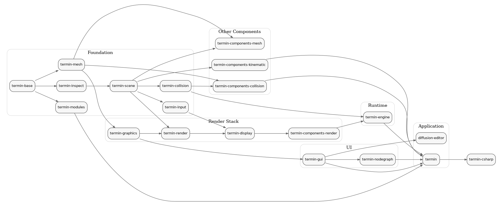

# Граф зависимостей модулей

Ниже показан текущий граф зависимостей между основными модулями и пакетами монорепозитория.

- Стрелка `A -> B` означает: `B` напрямую зависит от `A`.
- Транзитивные зависимости скрыты, чтобы граф оставался читаемым.
- Граф отражает верхнеуровневые модульные зависимости из `CMakeLists.txt`, `setup.py` и связанной package-конфигурации, а не каждый внутренний target.
- Source of truth для картинки: [library-dependencies.dot](./library-dependencies.dot)
- Открыть в полном размере: [PNG](./library-dependencies.png), [SVG](./library-dependencies.svg)

