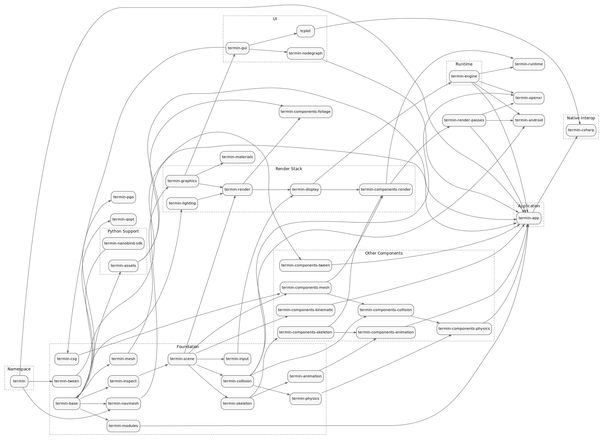

# Граф зависимостей библиотек

Ниже показан текущий граф зависимостей между основными C/C++ библиотеками монорепозитория.

- Стрелка `A -> B` означает: `B` напрямую зависит от `A`.
- Транзитивные зависимости скрыты, чтобы граф оставался читаемым.
- Граф отражает верхнеуровневые package-зависимости из `CMakeLists.txt`, а не каждый внутренний target.
- Source of truth для картинки: [library-dependencies.dot](./library-dependencies.dot)

