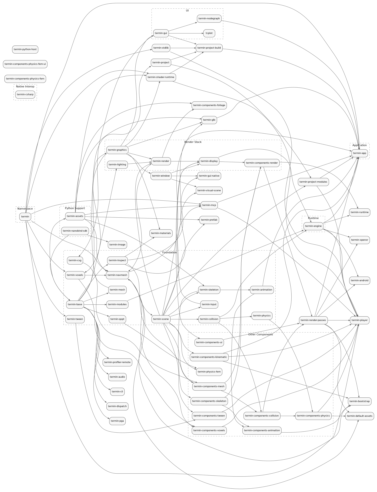

# Граф зависимостей модулей

Ниже показан текущий граф зависимостей между основными модулями и пакетами монорепозитория.

- Стрелка `A -> B` означает: модуль `A` зависит от модуля `B`.
- По умолчанию транзитивно избыточные стрелки и служебный namespace-пакет `termin` скрыты, чтобы обзор оставался читаемым.
- Граф автоматически собирается из `termin_require_package()`, `find_package()`, `target_link_libraries()`, `setup.py` и Python-import'ов. Небольшой список структурных зависимостей, которых нет в декларациях сборки, задан в генераторе явно.
- Source of truth: [gen-dependency-graph.py](../scripts/gen-dependency-graph.py). DOT, HTML и изображения являются генерируемыми артефактами.
- Обычная генерация: `python3 scripts/gen-dependency-graph.py`.
- Для аудита всех непосредственно объявленных зависимостей: `python3 scripts/gen-dependency-graph.py --all-direct`. Показать также namespace можно ключом `--show-namespace`.
- Интерактивный документ: [выбрать модуль и посмотреть его окружение](./library-dependencies.html). Он является standalone HTML и не требует сервера или доступа к интернету.
- Открыть в полном размере: [PNG](./library-dependencies.png), [SVG](./library-dependencies.svg)

